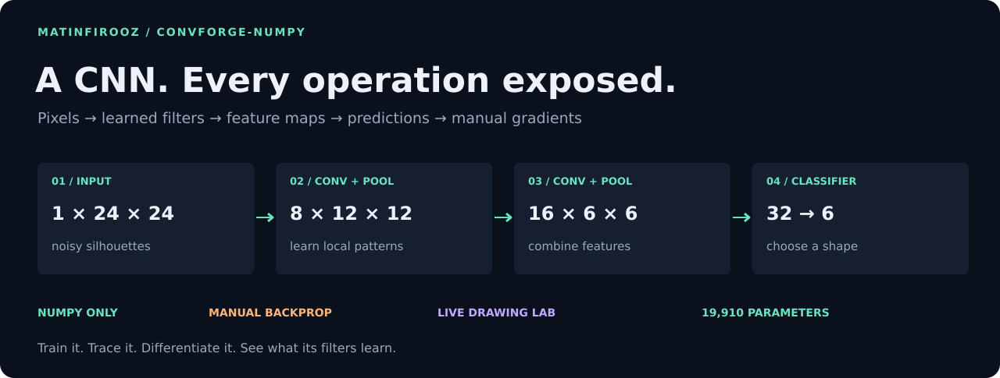
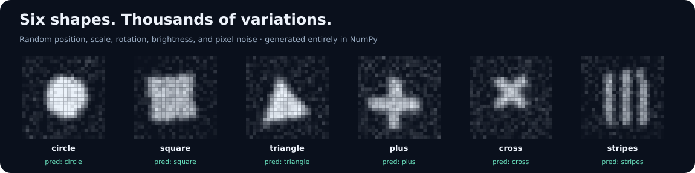
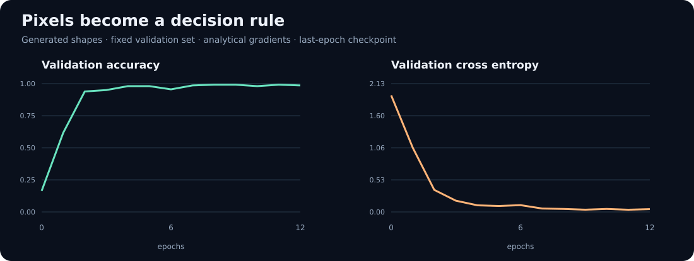
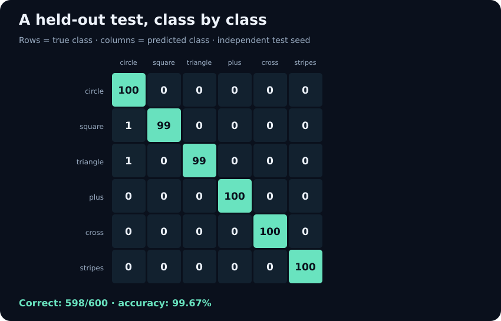
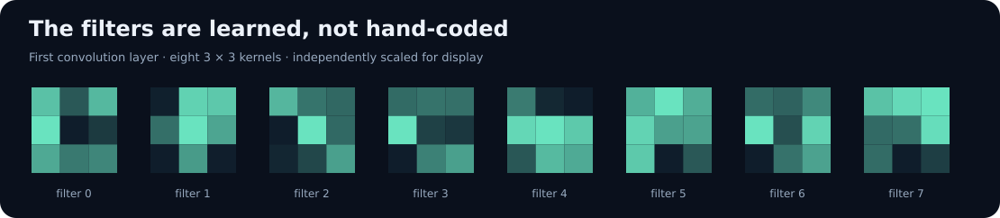
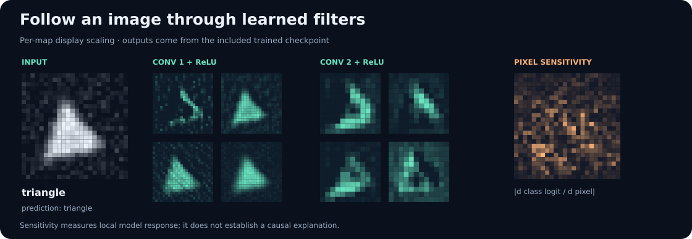

<p align="center"></p>

<h1 align="center">ConvForge · NumPy</h1>
<p align="center"><strong>Train a CNN. Trace its filters. Differentiate every operation.</strong></p>

<p align="center">
  
  
  
  <a href="LICENSE"></a>
</p>

<p align="center"><a href="#quick-start">Run it</a> · <a href="#a-drawing-lab-with-a-real-numpy-backend">Draw a shape</a> · <a href="docs/MATH.md">Read the math</a> · <a href="notebooks/CNN_From_Scratch.ipynb">Open the notebook</a> · <a href="docs/PUBLISH.md">Publish on GitHub</a></p>

Built for [**@matinfirooz**](https://github.com/matinfirooz). The CNN forward
pass, backward pass, losses, Adam optimizer, and generated image dataset use
**NumPy**. Every derivative is written explicitly. Visuals, checkpoints, and
the local web server use the Python standard library; the browser displays
the model's results. NumPy is the only third-party runtime dependency.

## What you get

| Implement | Inspect | Verify |
|:--|:--|:--|
| Convolution with stride, padding, dilation | Input patches and learned kernels | Independent scalar-loop reference |
| ReLU, pooling, dense layers, dropout | Every intermediate tensor | Analytical gradients vs finite differences |
| A trainable two-block CNN | Actual learning curves and predictions | Separate held-out generated test |
| im2col / col2im | Shared filters as matrix multiplication | Adjoint identity and overlap accumulation |
| Pixel-input gradients | Predicted-logit sensitivity | Full-model input derivative check |
| A live drawing laboratory | Feature maps from your own drawing | NumPy-backed HTTP prediction checks |

## Quick start

Extract the package and open a terminal in its directory:

```bash
cd ConvForge-NumPy
python -m venv .venv
```

Linux/macOS activation:

```bash
source .venv/bin/activate
```

Windows PowerShell activation:

```powershell
.venv\Scripts\Activate.ps1
```

Install the one runtime dependency and run the walkthrough:

```bash
python -m pip install -r requirements.txt
python -m examples.walkthrough
python -m unittest discover -s tests -v
```

Commands run from the **repository root**. The supplied checkpoint lets you
use the laboratory immediately, before retraining:

```bash
python -m examples.serve_lab
```

Open **http://127.0.0.1:8765**. Stop the server with Ctrl+C.

Optional: `python -m pip install -e .` makes `convforge` importable outside the
repository. Examples and notebooks remain in the repository, rather than
being installed as package modules.

## A CNN that actually learns



The default task has six classes: **circle, square, triangle, plus, cross,
and stripes**. Images vary in position, scale, rotation, brightness, and
Gaussian pixel noise. NumPy generates all examples; there is no dataset or
model download. Limited rotation keeps plus and diagonal cross distinct.

```bash
python -m examples.train_shapes --epochs 12 --seed 42
python -m examples.evaluate --per-class 100 --seed 2026
```



Included reference run: Python 3.12.14, NumPy 2.3.5, float32, seed 42,
12 epochs, batch size 64, 1,800 training images and 360 validation images.

| Measurement | Result |
|:--|--:|
| Learnable parameters | **19,910** |
| Initial validation accuracy | 16.39% |
| Final validation accuracy | **98.61%** |
| Held-out generated test accuracy | **99.67% — 598/600** |
| Test cross entropy | 0.01974 |
| Checkpoint reload | Exact probability agreement |



The last-epoch checkpoint is evaluated on a separate random seed. These are
single-seed results on a synthetic teaching dataset; they are not MNIST or
natural-image benchmark numbers. All result files are included:
[training history](docs/results/training_history.csv),
[training report](docs/results/train_report.json), and
[test report](docs/results/eval_report.json).

Training statistics average training-mode minibatches while weights change;
validation runs after each epoch with dropout disabled. The checkpoint stores
inference weights and model configuration, not optimizer/RNG state for exact
training resumption.

## Inside the model

| Stage | Shape per image | Parameters |
|:--|:--|--:|
| Input | `1 × 24 × 24` | 0 |
| Conv 3×3, same → ReLU | `8 × 24 × 24` | 80 |
| MaxPool 2×2 | `8 × 12 × 12` | 0 |
| Conv 3×3, same → ReLU | `16 × 12 × 12` | 1,168 |
| MaxPool 2×2 → Flatten | `576` | 0 |
| Dense → ReLU → training dropout | `32` | 18,464 |
| Classifier logits | `6` | 198 |

```python
import numpy as np
from convforge import TinyCNN, shape_dataset, CLASS_NAMES

images, labels = shape_dataset(per_class=2, seed=2026)
model = TinyCNN.load("docs/results/shape_cnn.npz")
probabilities = model.predict_proba(images)
predictions = probabilities.argmax(axis=-1)
print("True:", [CLASS_NAMES[i] for i in labels[:4]])
print("Pred:", [CLASS_NAMES[i] for i in predictions[:4]])
```

## Follow pixels through learned filters





```python
logits, _, activations = model.forward(images[:1], trace=True)
for name, tensor in activations.items():
    print(name, tensor.shape)
```

Each displayed feature map is independently normalized for readability. The
sensitivity view shows the absolute gradient of a selected class logit with
respect to pixels. It describes local model sensitivity; it is not a causal
explanation or Grad-CAM.

```python
class_index = int(model.predict_proba(images[:1])[0].argmax())
pixel_gradient = model.input_gradient(images[:1], class_index)
print(pixel_gradient.shape)  # (1, 1, 24, 24)
```

## A drawing lab with a real NumPy backend

```bash
python -m examples.serve_lab
```

At the printed localhost URL, draw a filled shape or load a supplied example.
Click **Predict with NumPy** to update probabilities, both convolution layers'
feature maps, and pixel sensitivity. The Python server performs the tensor
calculations; JavaScript only handles drawing and display.
The live server also refreshes gallery results from the checkpoint it loads,
so retraining does not leave stale sample predictions in the live view.

The server binds to `127.0.0.1`. It uses no Flask, FastAPI, React, or model
framework. Custom drawings can differ from the generated training distribution,
particularly if they are outlines rather than filled silhouettes. Softmax
probabilities are not calibrated guarantees.

[`docs/cnn_lab.html`](docs/cnn_lab.html) also opens directly as an **offline
gallery** of precomputed model outputs. Start the local server for predictions
on new drawings. GitHub's HTML viewer shows source rather than running the lab.

## Convolution from scratch

```python
from convforge import Conv2D, naive_conv2d

rng = np.random.default_rng(7)
x = rng.normal(size=(2, 3, 9, 11))
conv = Conv2D(3, 5, kernel_size=(3, 2), stride=(2, 1),
              padding="same", dilation=(1, 2), dtype=np.float64)
output, saved = conv.forward(x, training=True)
reference = naive_conv2d(x, conv.params["W"], conv.params["b"],
                         stride=(2, 1), padding="same", dilation=(1, 2))
np.testing.assert_allclose(output, reference, rtol=1e-12, atol=1e-12)
dx = conv.backward(np.ones_like(output), saved)
print(output.shape, dx.shape)
```

`Conv2D` uses cross-correlation without flipping the kernel. It converts local
windows into rows using `im2col`, applies a matrix product, then restores
NCHW layout. Backward computes input, kernel, and bias derivatives, adding
overlapping pixel contributions through `col2im`.

This explicit patch matrix may allocate substantial memory. It is a readable
CPU implementation, not a memory-minimal or GPU-optimized kernel.

## Train with explicit backward calls

```python
from convforge import Adam, cross_entropy, clip_gradients

fresh_model = TinyCNN(dropout=0.1, seed=42, class_names=CLASS_NAMES)
optimizer = Adam(fresh_model.parameters(), lr=0.003)
logits, saved, _ = fresh_model.forward(images, training=True)
loss, d_logits = cross_entropy(logits, labels)
fresh_model.backward(d_logits, saved)
gradients = fresh_model.gradients()
clip_gradients(gradients, max_norm=5.0)
optimizer.step(gradients)
print("One training step, loss:", round(loss, 4))
```

No autograd graph is involved. Caches belong to the caller; do not mutate their
inputs or update weights before backward. Layer backward overwrites parameter
gradients; tied weights and implicit gradient accumulation are not implemented.
`input_gradient` also overwrites gradient buffers, while leaving weights intact.

## Prove the math before trusting the accuracy

```bash
python -m examples.gradient_check
python -m unittest discover -s tests -v
```

The included **36 tests** check scalar convolution agreement, im2col/col2im
adjointness, overlap counts, stride/dilation/padding, pooling ties, pooling
overlap gradients, all convolution/dense derivatives, full-model derivatives,
dropout behavior, Adam, loss reduction, IDX parsing, checkpoint reload, and
the laboratory's actual NumPy prediction API.

The float64 convolution checker has maximum absolute derivative errors below
**1.8e-9**. [Its report](docs/results/gradient_report.json) includes shapes,
stride, dilation, seed, and finite-difference epsilon.

The reference tests were run locally on Python 3.12.14 / NumPy 2.3.5. The CI
workflow additionally configures Python 3.10 with NumPy 1.x and Python
3.12–3.13 with NumPy 2.x after upload; those remote results are not claimed to
have already run.

## Bring your own MNIST files

The NumPy/stdlib loader accepts local unsigned-byte IDX image/label files,
including `.gz`. Place your files in `data/mnist/` and run:

```bash
python -m examples.train_mnist \
  --images data/mnist/train-images-idx3-ubyte.gz \
  --labels data/mnist/train-labels-idx1-ubyte.gz \
  --limit 12000 --epochs 5
```

It uses a shuffled 90%/10% training/validation split from the supplied training
data, a 28×28 input, and ten digit classes. No downloading is attempted. Local
IDX parsing and the training path are smoke-tested with generated IDX fixtures;
the package does **not** include real MNIST data or a measured MNIST result.
The drawing lab is for the six-class shape model.

## Reproduce the complete showcase

```bash
python -m examples.reproduce
```

This runs tests, retrains the CNN, evaluates the held-out generated set,
checks derivatives, regenerates graphics and the laboratory, and executes
the notebook. It updates the curated `docs/results/`, `docs/assets/`, and
notebook files. Existing explicit BLAS thread settings are honored; otherwise
the script requests one thread before importing NumPy.

## Repository map

| Path | Purpose |
|:--|:--|
| `convforge/ops.py` | im2col, overlap-adding col2im, independent scalar convolution |
| `convforge/layers.py` | Convolution, dense, ReLU, pooling, flatten, dropout |
| `convforge/model.py` | Two-block CNN, explicit backward, inference checkpoints |
| `convforge/optim.py` | Stable cross entropy, Adam, global gradient clipping |
| `convforge/data.py` | Generated silhouettes, batching, local IDX loader |
| `convforge/inspect.py` | Model feature maps and pixel-gradient export |
| `convforge/visuals.py` | Standard-library SVG graphics |
| `examples/` | Training, testing, walkthrough, drawing server, reproduction |
| `tests/` | 36 meaningful correctness and integration tests |
| `notebooks/CNN_From_Scratch.ipynb` | Executed tutorial with actual numerical outputs |
| `docs/` | Math guide, laboratory, visuals, measured results, publishing instructions |
| `.github/workflows/ci.yml` | Python/NumPy compatibility checks |

Inputs use NCHW with nonempty dimensions and matching float32/float64 dtype.
Convolution weights use OIHW. Pooling is valid; same-padding convolution uses
ceil output dimensions. The current model accepts single-channel square
images. Grouped/depthwise convolution, batch normalization, GPU execution,
pretrained natural-image models, and automatic differentiation are outside
this implementation.

## Sources and credit

- LeCun et al., [Gradient-based learning applied to document recognition](https://doi.org/10.1109/5.726791), 1998.
- NumPy's [official sliding-window documentation](https://numpy.org/doc/stable/reference/generated/numpy.lib.stride_tricks.sliding_window_view.html).

ConvForge implements established CNN techniques for learning and inspection;
it does not claim a new convolution algorithm or reproduce LeNet's published
experiments.

**MIT licensed · built for [@matinfirooz](https://github.com/matinfirooz).**
